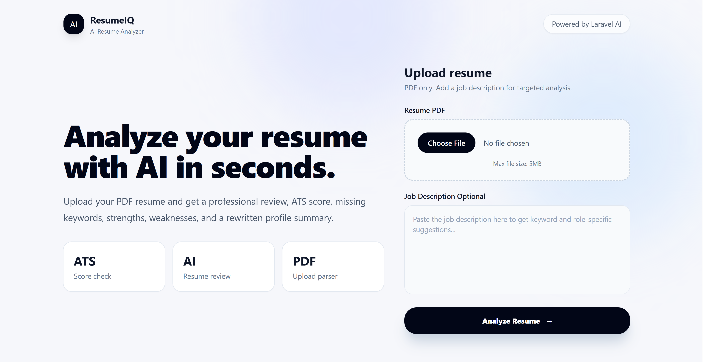
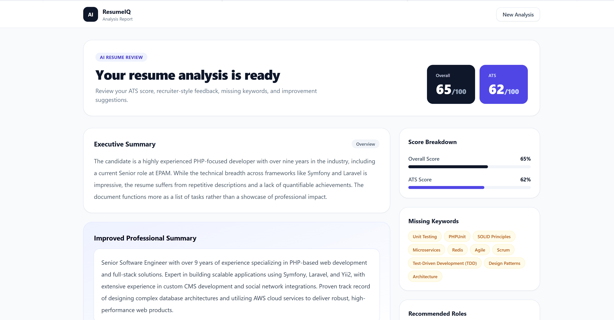

# Laravel CV Analyzer

AI-powered resume analyzer built with Laravel 13, Laravel AI, Gemini, Docker, and Tailwind CSS.

Upload a resume PDF and instantly get:

* ATS score
* Resume quality score
* Missing keywords
* Improvement suggestions
* Resume strengths & weaknesses
* Recommended roles
* Rewritten professional summary

---

## Preview

### Home Page



---

### Resume Analysis Result



---

# Features

* Laravel 13
* Laravel AI package
* Gemini AI integration
* ATS resume analysis
* PDF resume parsing
* Docker setup included
* Modern Tailwind UI
* Structured AI responses
* Production-ready architecture

---

# Tech Stack

* PHP 8.3
* Laravel 13
* Laravel AI
* Gemini API
* Tailwind CSS
* Docker
* Nginx
* MySQL / SQLite
* Smalot PDF Parser

---

# Installation

## 1. Clone Repository

```bash
git clone https://github.com/ajayyadavexpo/laravel-cv-analyzer.git

cd laravel-cv-analyzer
```

---

# Environment Setup

Create `.env`

```bash
cp .env.example .env
```

Add your Gemini API key:

```env
GEMINI_API_KEY=your_gemini_api_key_here
```

---

# Install Dependencies

```bash
composer install

npm install
```

---

# Generate App Key

```bash
php artisan key:generate
```

---

# Database Setup

## SQLite (recommended for local)

```bash
touch database/database.sqlite
```

Update `.env`

```env
DB_CONNECTION=sqlite
```

Run migrations:

```bash
php artisan migrate
```

---

# Run Application

## Development

```bash
composer run dev
```

Application:

```txt
http://127.0.0.1:8000
```

---

# Docker Setup

## Start Containers

```bash
docker compose up -d --build
```

---

## Stop Containers

```bash
docker compose down
```

---

## Run Laravel Commands Inside Container

```bash
docker compose exec app php artisan migrate

docker compose exec app php artisan optimize
```

---

# Configure Gemini AI

This project uses Google Gemini through Laravel AI.

Get API Key:

* [https://aistudio.google.com/app/apikey](https://aistudio.google.com/app/apikey)

Add in `.env`

```env
GEMINI_API_KEY=your_gemini_api_key_here
```

---

# Routes

```php
Route::get('/', [ResumeAnalyzerController::class, 'index'])
    ->name('resume.index');

Route::post('/analyze', [ResumeAnalyzerController::class, 'analyze'])
    ->name('resume.analyze');
```

---

# Resume Analysis Output

The AI returns:

* Overall Resume Score
* ATS Score
* Resume Summary
* Strengths
* Weaknesses
* Missing Keywords
* ATS Issues
* Improvement Suggestions
* Recommended Roles
* Rewritten Professional Summary

---

# Project Structure

```txt
app/
 ├── Ai/
 │    └── Agents/
 │         └── ResumeAnalyzer.php
 │
 ├── Http/
 │    └── Controllers/
 │         └── ResumeAnalyzerController.php
 │
resources/
 └── views/
```

---

# Example `.env`

```env
APP_NAME="Laravel CV Analyzer"
APP_ENV=local
APP_KEY=
APP_DEBUG=true
APP_URL=http://localhost

DB_CONNECTION=sqlite

GEMINI_API_KEY=your_gemini_api_key_here
```

---

# Production Notes

## Recommended

* Queue AI requests
* Add rate limiting
* Store analysis history
* Add authentication
* Add caching
* Add PDF OCR support
* Add resume templates
* Add export to PDF

---

# Security

* Prompt injection protection included
* File validation enabled
* PDF-only uploads
* Structured AI output schema
* UTF-8 cleaning for parsed PDFs

---

# Composer Packages

```json
"laravel/ai": "^0.6.8",
"smalot/pdfparser": "^2.12"
```

---

# Deployment

Works on:

* VPS
* Docker
* Laravel Forge
* DigitalOcean
* AWS
* Railway
* Render

---

# Commands

## Format Code

```bash
./vendor/bin/pint
```

---

## Run Tests

```bash
php artisan test
```

---

# License

MIT License

---

# Author

### Ajay Yadav

GitHub:

[ajayyadavexpo GitHub](https://github.com/ajayyadavexpo?utm_source=chatgpt.com)

Project Repository:

[Laravel CV Analyzer Repository](https://github.com/ajayyadavexpo/laravel-cv-analyzer?utm_source=chatgpt.com)
